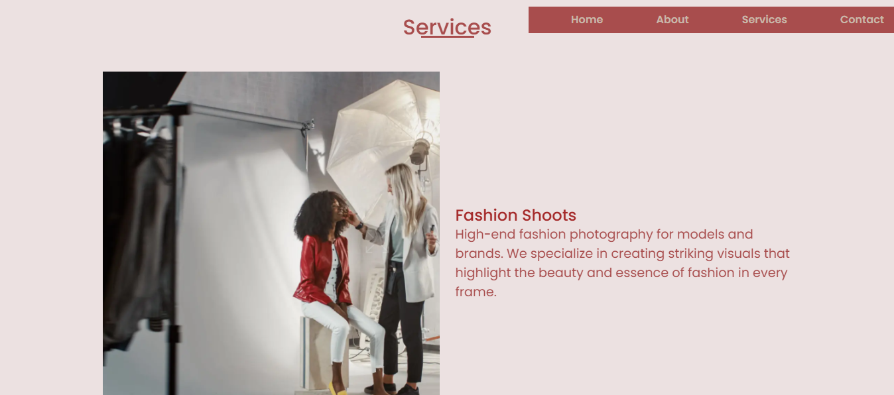

# VogueFrame Studios

**VogueFrame Studios** is a premium fashion photography studio website that is fully responsive and optimized for both mobile and desktop screen sizes. The website showcases the studio's offerings, including services such as fashion shoots, portfolio creation, and editorial photography. It features an engaging and dynamic user experience, with smooth animations, a full-screen background video, and a well-organized navigation menu.

## Features

- **Fully Responsive**: The website is optimized for both mobile and desktop users, providing a seamless experience across devices.
- **Background Video**: A high-quality fashion video plays in the background, adding a dynamic touch to the homepage.
- **Interactive Navigation**: A mobile-friendly navigation menu that toggles on smaller screens.
- **Service Showcases**: Highlighting the studio's primary services with professional images and descriptions.
- **Contact Form**: Users can easily get in touch through email or phone, with social media links provided.
- **Image Sliders and Animations**: Animated images are featured in service sections to showcase fashion photography.

## Technologies Used

- **HTML5**: Structured content and layout.
- **CSS3**: Styling the webpage with modern design techniques.
- **JavaScript**: Added interactivity for the navigation and animations.
- **Bootstrap 5**: Used for grid systems and responsiveness.
- **Boxicons**: For social media icons.

